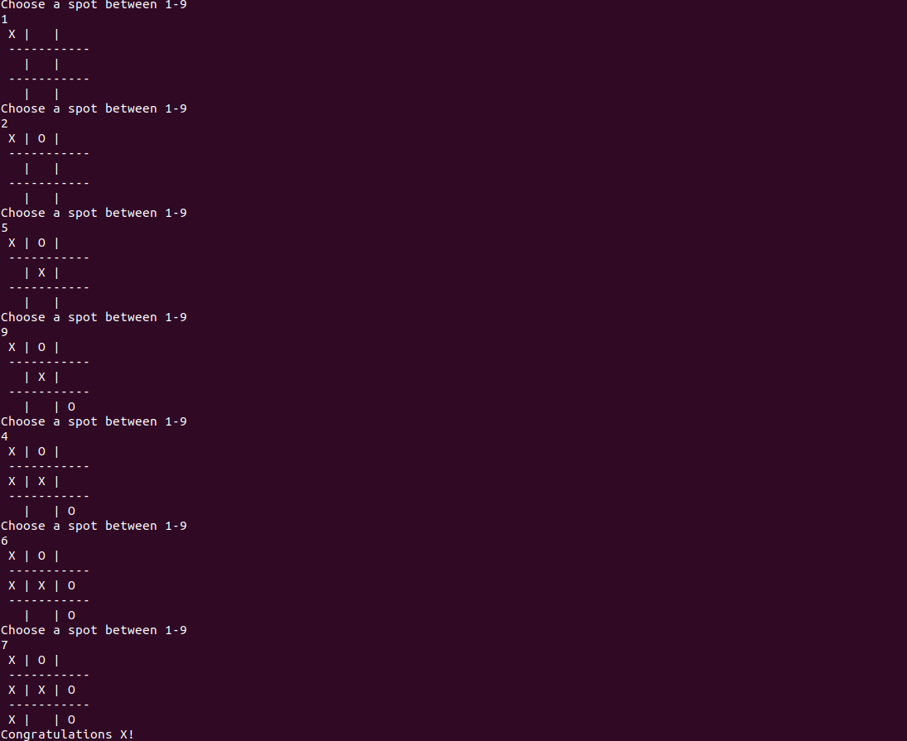

# RUBY TIC TAC TOE
> This is an object oriented implementation of the tic tac toe game using ruby

## Languages and topics covered
 - Ruby
 - Object Oriented Programming

## Getting Started
To get a local copy up and running follow these simple example steps.
- Clone all the files and branches into your local machine

### Prerequisites

- Ruby should be well installed and configured
- A terminal should be installed

### How to Play

- To get started execute the ruby file: 'bin/main.rb' by running ruby bin/main.rb
- Each player makes his/her move until either one wins or it's a draw
- One can win if he/she matches either horizontally, vertically or diagonally
## Authors

👤 **Nick**

- GitHub: [@Nkuria](https://github.com/Nkuria)
- LinkedIn: [Nick Kuria](https://www.linkedin.com/in/nkuria/)
